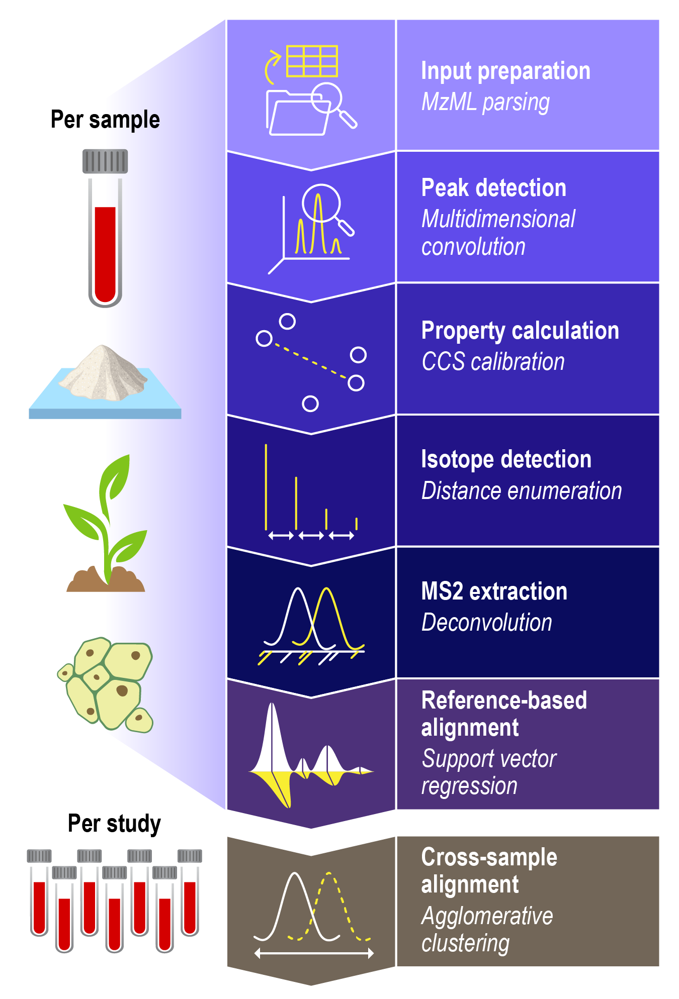

======
DEIMoS
======

DEIMoS, or Data Extraction for Integrated Multidimensional Spectrometry, is a Python application 
programming interface and command-line tool for high-dimensional mass spectrometry (MS) data 
analysis workflows that offers ease of development and access to efficient algorithmic implementations. 
Functionality includes feature detection, feature alignment, collision cross section (CCS) calibration, 
isotope detection, and MS/MS spectral deconvolution, with the output comprising detected features aligned 
across study samples and characterized by mass, CCS, tandem mass spectra, and isotopic signature. 
Notably, DEIMoS operates on N-dimensional data, largely agnostic to acquisition instrumentation; 
algorithm implementations simultaneously utilize all dimensions to (i) offer greater separation between features, 
thus improving detection sensitivity, (ii) increase alignment/feature matching confidence among datasets, 
and (iii) mitigate convolution artifacts in tandem mass spectra.

.. toctree::
	:caption: Getting Started
	:name: getting_started
	:hidden:
	:maxdepth: 1

	getting_started/installation
	getting_started/example_data
	getting_started/cli

.. toctree::
	:caption: User Guide
	:name: user_guide
	:hidden:
	:maxdepth: 1

	user_guide/loading_saving
	user_guide/peak_detection
	user_guide/ccs_calibration
	user_guide/ms2_extraction
	user_guide/isotope_detection
	user_guide/extracted_ion
	user_guide/alignment

.. toctree::
	:caption: API Reference
	:name: api_reference
	:hidden:
	:maxdepth: 1

	api_reference/deimos
	api_reference/alignment
	api_reference/calibration
	api_reference/cli
	api_reference/deconvolution
	api_reference/filters
	api_reference/grid
	api_reference/io
	api_reference/isotopes
	api_reference/peakpick
	api_reference/plot
	api_reference/subset
	api_reference/utils

.. toctree::
	:caption: Project Info
	:name: project_info
	:hidden:
	:maxdepth: 1

	project_info/acknowledgements
	project_info/citing_and_citations
	project_info/contributing
	project_info/license
	project_info/disclaimer

